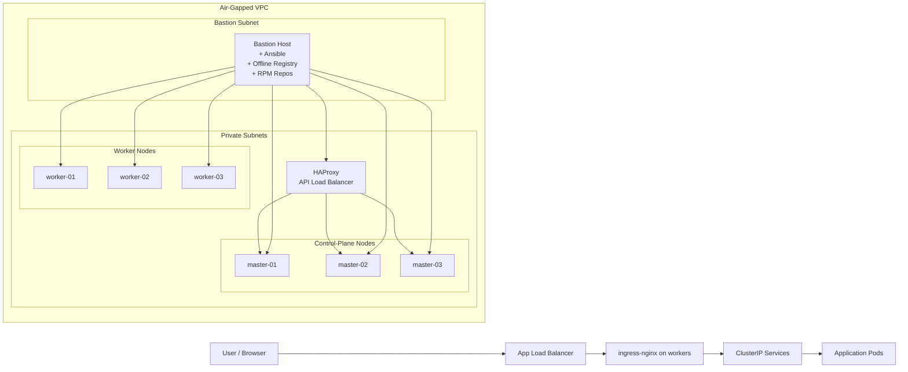

# Air-Gapped Kubernetes Cluster Automation (Ansible + Helm)

This repository contains my personal automation for building a **production-style, air-gapped Kubernetes cluster** using **Ansible** and **Helm**.

The goal of this project is to demonstrate:

- End-to-end provisioning of a multi-node Kubernetes cluster with **no direct Internet access** on control-plane and worker nodes.
- Use of a **bastion host** to provide an **offline container registry** and **RPM/YUM repositories**.
- Automated installation of **Calico CNI**, **ingress-nginx**, and a sample application via **Helm**.
- Infrastructure and configuration expressed as **idempotent Ansible roles** and **Helm charts/values**.

---

## 1. High-Level Architecture

At a high level, the environment looks like this (example using AWS EC2, but the pattern is generic):

- **Bastion Host**
  - Has Internet access (or temporary staged access).
  - Mirrors OS packages into **offline YUM repositories**.
  - Hosts a **private container registry** (e.g. registry on port 5000).
  - Acts as Ansible control node and jump host for SSH.
- **Kubernetes API Load Balancer**
  - Runs **HAProxy** (TCP mode) in front of all control-plane nodes.
  - Exposes `kube-apiserver` on a stable VIP (e.g. `k8s-lb:6443`).
- **Control-Plane Nodes** (e.g. 3 nodes)
  - Installed with `kubeadm` using the HAProxy endpoint as `controlPlaneEndpoint`.
  - Run `kube-apiserver`, `kube-scheduler`, `kube-controller-manager`, and stacked `etcd`.
- **Worker Nodes** (e.g. 3 nodes)
  - Join the cluster via `kubeadm join`.
  - Run workloads and **ingress-nginx**.
- **Application Ingress / Load Balancer (optional)**
  - An external HAProxy or L4/L7 load balancer in front of the ingress-nginx service (NodePort).
  - Used to expose HTTP/HTTPS applications from the cluster.

**Conceptual diagram (simplified):**


All control-plane and worker nodes are in private subnets with no direct Internet access. They reach:

The offline YUM repos on the bastion.

The offline container registry on the bastion.

The Kubernetes API through the HAProxy load balancer.

## 2. Key Features
Air-gapped friendly design
No Internet required on masters/workers.

Pre-mirrored RPM repositories and container images.

Ansible-driven automation
Roles for node prerequisites, container runtime, kubeadm, CNI, ingress, Helm, etc.

Idempotent tasks and clear separation of responsibilities per role.

HA Kubernetes control plane
Multiple control-plane nodes behind a single HAProxy endpoint.

Calico CNI
Network plugin installed from offline images.

Ingress-nginx via Helm
Installed using a local Helm chart / tarball and custom values.

Supports host-based routing (e.g. hello.local).

Sample application deployment
Simple nginx-based app deployed via Helm to validate the infrastructure.

## 3. Repository Structure
Adjust the structure below to match your actual folder layout.

```
.
├── ansible/
│   ├── inventories/
│   │   └── hosts.yaml          # Inventory with bastion, masters, workers, load balancers
│   ├── group_vars/
│   │   └── all.yaml            # Cluster-wide variables (CIDRs, versions, registry URL, etc.)
│   ├── roles/
│   │   ├── bastion_offline_registry/
│   │   ├── node_prereqs/
│   │   ├── containerd_install/  # or docker_install/
│   │   ├── kube_binaries/
│   │   ├── kubeadm_init/
│   │   ├── kubeadm_join_controlplane/
│   │   ├── kubeadm_join_worker/
│   │   ├── calico_install/
│   │   ├── helm_install/
│   │   └── ingress_deploy/
│   └── site.yaml               # Main playbook orchestrating all roles
├── helm/
│   ├── charts/
│   │   └── ingress-nginx-4.11.0.tgz    # Offline Helm chart
│   └── values/
│       └── ingress-nginx-values.yaml   # Custom values (NodePort, host, etc.)
├── docs/
│   └── architecture.md         # (Optional) Extended architecture notes
└── README.md
```
## 4. Air-Gap Strategy
## 4.1. Package and image mirroring
From an online environment (or temporarily online bastion):

Mirror OS packages (RHEL / Rocky / Alma, etc.) into a local YUM repo structure.

Download all required container images and save them as tarballs, for example:

Kubernetes core images (kube-apiserver, kube-controller-manager, kube-scheduler, etcd, coredns, pause).

Calico images.

ingress-nginx images.

Application images (e.g. nginx for the sample app).

Transfer the RPMs and image tarballs to the bastion (e.g. via scp or aws s3 sync with a VPC endpoint).

## 4.2. Bastion host setup (Ansible)

The bastion_offline_registry role typically:

Configures and enables a private container registry (e.g. registry.local:5000).

Loads all image tarballs and re-tags them under the internal registry.

Serves offline YUM repos via HTTP (e.g. using httpd or nginx).

Optionally configures HAProxy for:

Kubernetes API load balancer (e.g. binding on *:6443).

Application load balancing in front of ingress-nginx.

Applies necessary SELinux settings, such as:

```
bash
setsebool -P haproxy_connect_any 1
```

## 5. Ansible Workflow

A typical end-to-end run looks like this:

## 5.1. Prepare inventory and variables
Edit ansible/inventories/hosts.yaml:

Define groups: bastion (gsu), control, worker, k8s_lb, app_lb (if any).

Edit ansible/group_vars/all.yaml:

Kubernetes version.

Pod CIDR, Service CIDR.

controlPlaneEndpoint (HAProxy VIP / DNS).

Offline registry address.

YUM repo base URLs.

## 5.2. Bootstrap bastion

```
bash
cd ansible
ansible-playbook -i inventories/hosts.yaml site.yaml --tags "bastion"
```

## 5.3. Prepare control-plane and worker nodes

Install prerequisites: disable swap, configure kernel modules, sysctl, time sync, etc.

Install and configure container runtime (containerd or docker).

Point YUM to the offline repos.

```
bash
ansible-playbook -i inventories/hosts.yaml site.yaml --tags "node_prereqs,containerd_install"
```

## 5.4. Initialize the first control-plane node

Use kubeadm_init role to:

Generate kubeadm-config.yaml with controlPlaneEndpoint set to the API HAProxy.

Run kubeadm init.

Configure ~ec2-user/.kube/config (or another user) for kubectl access.

Save the join commands for other nodes into Ansible facts.

```
bash
ansible-playbook -i inventories/hosts.yaml site.yaml --tags "kubeadm_init"
```

## 5.5. Join additional control-plane and worker nodes

kubeadm_join_controlplane uses the stored join command to add more masters.

kubeadm_join_worker adds worker nodes.

```
bash
ansible-playbook -i inventories/hosts.yaml site.yaml --tags "kubeadm_join_controlplane,kubeadm_join_worker"
```

## 5.6. Install Calico CNI

The calico_install role applies a pre-downloaded and modified calico.yaml (all image references point to the offline registry).

```
bash
ansible-playbook -i inventories/hosts.yaml site.yaml --tags "calico_install"
```

## 5.7. Install Helm and deploy ingress-nginx

helm_install installs the Helm CLI on the bastion.

ingress_deploy:

Uses the offline chart helm/charts/ingress-nginx-4.11.0.tgz.

Applies helm/values/ingress-nginx-values.yaml.

Creates a NodePort or LoadBalancer service for ingress.

```
bash
ansible-playbook -i inventories/hosts.yaml site.yaml --tags "helm_install,ingress_deploy"
```

## 5.8. Deploy a sample application

Example: a simple nginx Helm chart with host hello.local.

Used to validate:

DNS resolution inside the cluster.

Ingress routing via ingress-nginx.

External access via the application load balancer (if configured).

## 6. Example: Validating the Cluster

After the playbooks complete:

Check nodes
```
bash
kubectl get nodes -o wide
```

Check system pods
```
bash
kubectl get pods -A
```

Check ingress controller
```
bash
kubectl -n ingress-nginx get svc,deploy,pods
```

Test application access
From a host that can reach the application load balancer or worker NodePort:
```
bash
curl -v -H "Host: hello.local" http://<APP_LB_OR_NODE_IP>:<PORT>/
```

You should see the default nginx welcome page or your custom application response.

## 7. Technologies Used

Operating System: RHEL-based (RHEL / Rocky / Alma)

Container Runtime: containerd or Docker (configurable via Ansible)

Kubernetes: kubeadm-based cluster (multi-master, HA control plane)

CNI: Calico

Ingress: ingress-nginx (Helm chart)

Automation: Ansible (roles + inventory + group_vars)

Packaging: Helm for application deployment

Load Balancing: HAProxy for API and optional application traffic

## 8. Notes & Limitations

This is a personal reference implementation, not a complete product.

Security hardening (RBAC, PodSecurity, TLS management, etc.) is only partially shown and should be adapted to organizational standards.

Some values (IPs, hostnames, DNS names) are anonymized / generic for public sharing.
